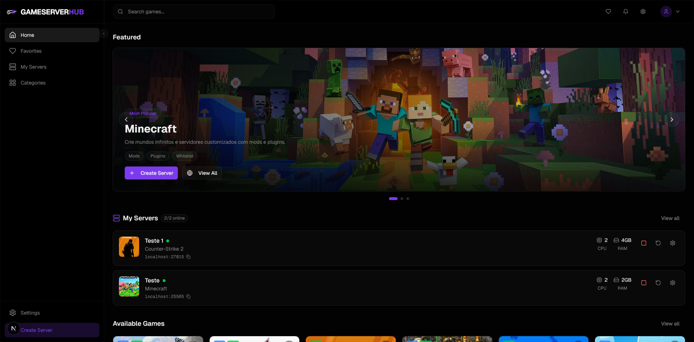

# 🎮 Game Server Hub (GSH)



**Game Server Hub** is a modern and robust open-source platform developed with Next.js for simplified game server management and deployment via Docker.

The goal is to provide an intuitive interface where anyone can spin up, configure, and monitor game servers without having to deal directly with the command line.

---

## ✨ Current Features

- 🚀 **One-Click Deploy**: Spin up servers in seconds using Docker.
- 📂 **Inline File Manager**: View and edit configuration files (`.cfg`, `.properties`, `.json`, etc.) directly in the browser.
- 🌐 **Advanced Networking**:
  - **UPnP Support**: Automatic port forwarding for supported routers.
  - **Firewall Management**: Automatic Windows Firewall rule management for server ports.
  - **Custom Domains**: Support for linking custom domains to servers.
- 🛠️ **Advanced Admin Panel**:
  - Command execution via RCON.
  - Interactive Terminal with real-time logs.
  - Dynamic map switching (CS2 Workshop support).
  - World Management (Upload/Download worlds).
  - Persistent settings via Database.
- 📈 **Monitoring**: Server status, resource usage, and real-time logs.

---

## 🕹️ Supported Games

Currently, GSH officially supports:
- ✅ **Minecraft Java Edition** (using the `itzg/minecraft-server` image)
- ✅ **Counter-Strike 2** (using the `joedwards32/cs2` image)
- ✅ **Terraria** (using the `beardedio/terraria` image)

### 🔜 Upcoming Games (In Development)
We are working to add support for:
- [ ] Assetto Corsa
- [ ] Rust
- [ ] Valheim
- [ ] Garry's Mod
- [ ] Ark: Survival Evolved
- [ ] Palworld
- [ ] Factorio
- [ ] Project Zomboid
- [ ] Don't Starve Together (DST)

---

## 🗺️ System Roadmap (TODO)

- [ ] **Internationalization (i18n)**: Full support for English (EN) and Portuguese (PT-BR).
- [ ] **Cloud Backup System**: Automated backups to S3 or Google Drive.

---

## 🚀 Technologies Used

- **Frontend/Backend**: [Next.js 14](https://nextjs.org/) (App Router)
- **Styling**: Tailwind CSS + Shadcn/UI
- **Database**: Prisma + SQLite (local default)
- **Infrastructure**: Docker & Docker Compose
- **Communication**: RCON Protocol & Docker Engine API

---

## 🤝 Contributing

This is an **Open Source** project and contributions of all levels are very welcome!

If you want to help add a new game, fix a bug, or suggest a feature:
1. **Fork** the project.
2. Create a **Branch** for your feature (`git checkout -b feature/new-game`).
3. **Commit** your changes (`git commit -m 'feat: add support for Terraria'`).
4. Submit a **Pull Request**.

Feel free to open an **Issue** to discuss improvements!

---

## 🛠️ Local Installation

1. Clone the repository:
   ```bash
   git clone https://github.com/thalysm/gameserverhub.git
   ```
2. Install dependencies:
   ```bash
   npm install
   ```
3. Configure environment variables based on `.env.example`.
4. Run database migrations:
   ```bash
   npx prisma migrate dev
   ```
5. Start the development server:
   ```bash
   npm run dev
   ```

---

## 📄 License

Distributed under the MIT License. See `LICENSE` for more information.

---
Developed with ❤️ by the GSH community.
